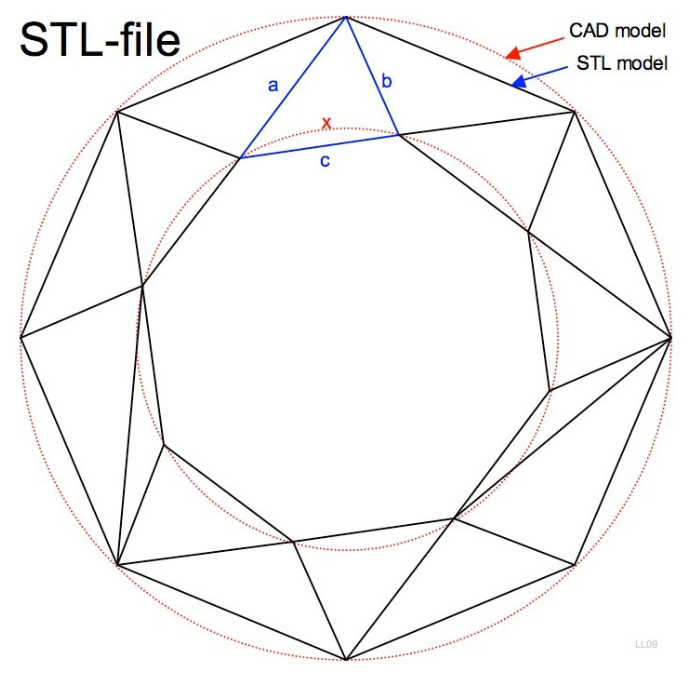
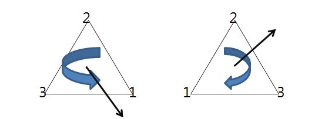
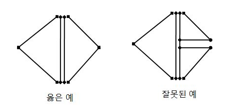

- STL(STereoLithograhpy) : 3차원 데이터를 표현하는 국제 표준 형식 (3D프린터는 STL을 표준 파일 포맷으로 채택)

  STL은 3차원 형상을 무수히 많은 삼각형 면으로 구성하여 표현해주는 일종의 폴리곤 포멧이기 때문에 삼각형의 크기가 작을수록 고품질의 출력물 표면을 얻을 수 있다.

  STL 파일은 곡면을 표현하기가 곤란하지만 삼각형의 분할 수를 많이 늘려서 보다 섬세한 삼각형으로 그려내면 곡면과 유사한 형상이 된다.

  STL 모델의 색상(컬러)에 대한 정보는 저장하지 않으며 오직 한가지 색상만으로 저장한다.

  STL 파일을 Binary 파일로 내보내기만 하면 시간과 파일 크기를 줄일 수 있습니다. 

  Chord Tolerance(현 공차) 또는 Angular Control(각 제어)과 같은 옵션을 변경하면 STL 파일의 해상도가 변경된다.

  

  

  STL 파일 형식은 삼각형을 이루는 세개의 꼭지점과 벡터(크기와 방향 중 방향만)를 기본 형식으로 사용한다.

  

  엄지손가락을 세우고 나머지 손가락으로 꼭지점의 번호 순서로 돌리면 엄지손가락(오른손 법칙)이 가르키는 방향이 면의 방향(벡터)가 된다.

  STL 파일 형식의 오류에서 "면이 뒤집어졌다." 는 꼭지점의 순서가 반대로 되는 경우다.

  

  STL 파일 형식의 또 다른 특징은 아래 그림과 같이 삼각형은 서로 인접한 삼각형과 정확히 두개의 꼭지점을 공유해야 한다.

  

  STL 파일 형식의 오류에서 "오버래핑, 홀이 있다." 는 꼭지점이 정확히 연결되지 않은 경우

  STL 파일 오류를 수정해주는 소프트웨어 : Mashlab, Netfabb Basic