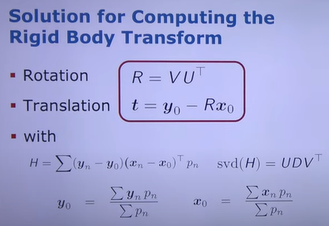

# ICP & PCD Registration

https://www.youtube.com/watch?v=dhzLQfDBx2Q

기존의 데이터셋에 현재 데이터를 Registration(정합)시키는 방법중의 하나로, 각 데이터들의 가장 가까운점을 이용하여 연관성을 찾고 그에 맞게 현재데이터를 이동 및 회전을 시켜 기존데이터셋에 추가하는 방법

Registration of 3D data points

- goal - find the parameters of the transformation that best align corresponding data points (find rotation matrix , translation vector)

- Optimization / search parameters

  - Iterative closest point (ICP)  - SVD를 기초로 함

  - Robust least squares approaches

Basic Alignment Problem

- Y = {, ..., }, X = {, ..., } with correspondences C = {(i, j)}

- Translation t and rotation R that minimize the sum of the squared errors

Simplified Correspondences

- reordering point clouds X, Y given correspondences C using an index N
  
  

SVD - Based Alignment

translate and rotate points :      |     n = 1, ..., N